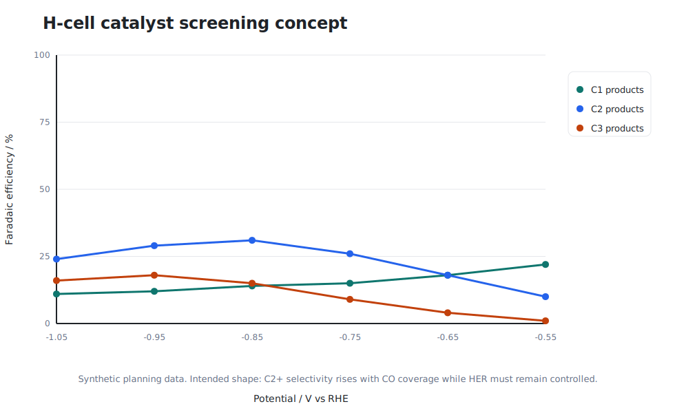
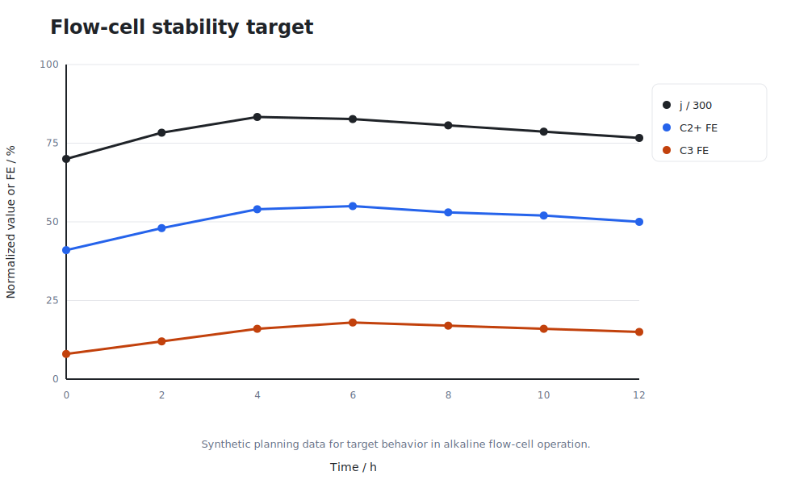
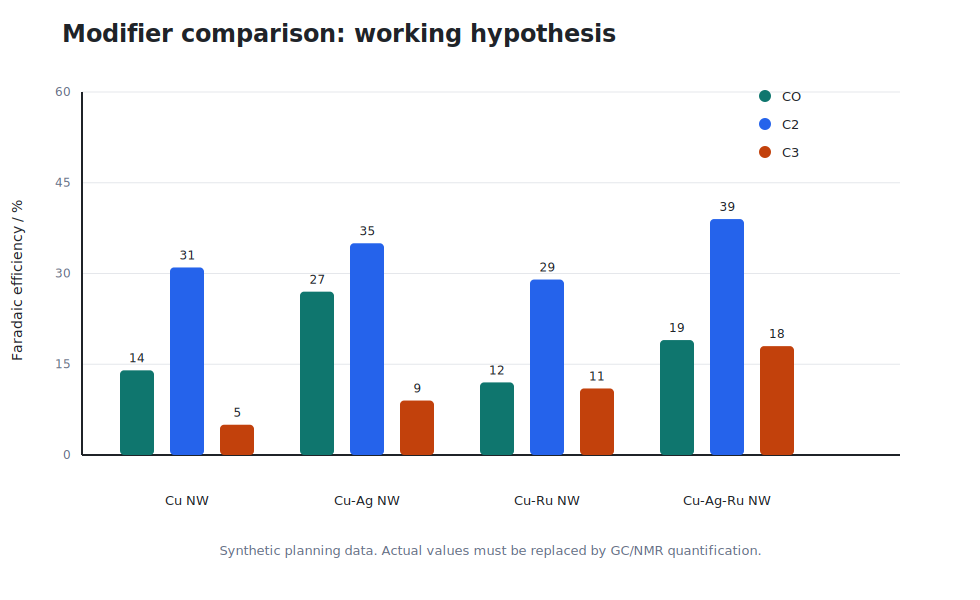
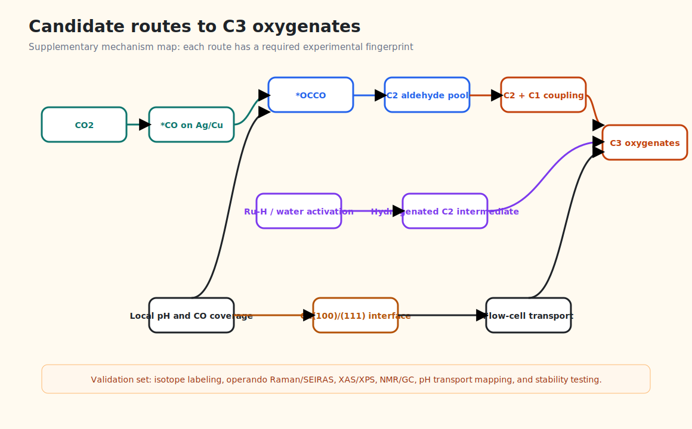

# Tandem Cu/Ag/Ru Nanowire Catalysts for CO2 Electroreduction toward C3 Oxygenates in H-Cell and Flow-Cell Platforms

## Manuscript Status

Draft for mechanism planning and experimental design. All graphs in this draft are simulated and must be replaced with real experimental data before journal submission.

## Abstract

Electrochemical CO2 reduction reaction (CO2RR) on copper is one of the few known catalytic routes that can convert CO2 into multicarbon fuels and chemical feedstocks under ambient pressure. However, selective formation of C3 oxygenates such as n-propanol remains difficult because the reaction requires efficient CO generation, high surface *CO coverage, C-C coupling, controlled hydrogenation, and suppression of hydrogen evolution. Here we propose a tandem Cu/Ag/Ru nanowire catalyst architecture designed for stepwise CO2-to-CO activation, C-C coupling on reconstructed copper, and selective hydrogenation of C2/C3 oxygenated intermediates. The design uses Cu nanowires grown from oxide-derived copper as the high-area C-C coupling scaffold, Ag nanoparticles derived from AgNO3 as local CO-generating domains, and Ru-containing nanoparticles derived from hydrated RuCl3 as hydrogenation and water-activation modifiers. The concept is evaluated as a staged experimental program across H-cell screening and alkaline flow-cell operation. Simulated figures are provided as manuscript-quality placeholders for the expected trends: Ag increases local CO availability, Ru shifts the oxygenate/hydrocarbon balance if hydrogen coverage is controlled, and the combined Cu/Ag/Ru architecture gives the strongest synthetic target response for C2+ and C3 products. A supplementary pathway file defines four candidate C3 mechanisms and the characterization signatures required to confirm or reject each pathway.

## Keywords

CO2 electroreduction; copper nanowires; silver nanoparticles; ruthenium modifier; C3 coupling; n-propanol; H-cell; flow cell; gas diffusion electrode.

## 1. Introduction

Electrochemical CO2RR offers a route to store renewable electricity in chemical bonds while recycling carbon into useful products. Among monometallic electrodes, copper remains unique because it can form hydrocarbons and oxygenates beyond C1 products, including ethylene, ethanol, acetate, propanol, and related intermediates [Hori1989; Kuhl2012; Nitopi2019]. The same feature makes copper difficult to control: small changes in surface structure, electrolyte composition, local pH, CO coverage, cation identity, and mass transport can redirect selectivity among hydrogen evolution, CO, methane, ethylene, ethanol, acetate, and trace C3 products [Resasco2017; Ringe2019; Bui2022].

The formation of C3 oxygenates is especially demanding. A plausible catalyst must generate a high local concentration of *CO or CO-derived intermediates, maintain Cu ensembles that favor C-C coupling, and provide hydrogenation steps that are active enough to form alcohols but not so aggressive that hydrogen evolution dominates. Early mechanistic work established copper as the central platform for C2+ CO2RR [Hori1989]. Later studies connected selectivity to surface structure, oxide-derived reconstruction, high roughness, and local reaction environments [Nitopi2019; Ma2016; Miao2022]. Recent computational and experimental work further indicates that Cu(100)/Cu(111) interfacial motifs can favor CO dimerization, a critical early step for multicarbon formation [Wu2022].

H-cell measurements remain useful for catalyst discovery because they provide controlled liquid-electrolyte conditions and straightforward product analysis. Their limitation is CO2 mass transport. In aqueous electrolytes, low CO2 solubility restricts current density and can make promising catalysts appear less active than they would be under gas-fed operation. Gas diffusion electrodes, membrane electrode assemblies, and flow-cell systems improve CO2 delivery and allow industrially relevant current densities [Dinh2020; Liu2020; Jiang2023]. A credible catalyst program therefore needs both H-cell mechanistic screening and flow-cell validation.

This draft proposes a Cu/Ag/Ru nanowire system for C3 oxygenate formation. The central hypothesis is tandem operation: Ag-rich particles increase local CO supply, Cu nanowire surfaces reconstruct into high-density C-C coupling sites, and small Ru-containing domains influence proton/electron transfer and hydrogenation of oxygenated intermediates. This idea draws from the broader tandem catalyst literature, including Cu-Ag systems that increase CO availability [Jiang2023], oxide-derived Cu systems that can improve alcohol pathways [Wang2024], and Ag-Ru-Cu CO reduction concepts that demonstrate the value of combining CO-generating and hydrogenation-capable components for n-propanol synthesis [Li2022].

## 2. Catalyst Design Rationale

The target catalyst is a rough Cu nanowire forest decorated with Ag and Ru-containing particles. Cu nanowires provide high surface area, abundant grain boundaries, and electrochemically reconstructable oxide-derived domains. Nanowire or nanostructured Cu systems have been reported to shift CO2RR away from simple C1 products by increasing local pH, intermediate residence time, and C-C coupling probability [Ma2016; Nitopi2019]. In this design, Cu is not treated as a static support. It is the dynamic active phase that evolves during electrolysis.

Ag is introduced from AgNO3 as a CO-generating modifier. Silver is generally more selective for CO than for deep reduction products, so Ag domains near Cu can enrich the local *CO or dissolved CO pool. That local CO supply can increase the probability of Cu-mediated CO dimerization and downstream C2+ formation, provided Ag loading does not physically block Cu ensembles [Bui2022; Jiang2023]. In the proposed architecture, Ag particles should be sparse and spatially distributed along the Cu nanowire surface rather than forming a continuous shell.

Ru is introduced from RuCl3.xH2O, specified as 30% Ru, as a low-loading modifier. Ru is intentionally treated as a risky but potentially useful component. Too much Ru may increase hydrogen evolution, but small Ru-containing domains could tune hydrogen coverage, water activation, or hydrogenation of aldehyde-like C2/C3 intermediates. The most defensible role for Ru is not "C-C coupling site", but "hydrogenation and proton-transfer modifier" adjacent to Cu coupling domains. Ag-Ru-Cu systems have been discussed in the CO reduction literature as a route toward n-propanol, supporting the broader tandem logic [Li2022].

Figure 1 shows the proposed architecture.

Figure 1. Conceptual Cu/Ag/Ru nanowire catalyst from the supplied Illustrator source file. Ag-rich particles increase CO supply, reconstructed Cu nanowires provide C-C coupling sites, and low-loading Ru-containing domains are proposed to tune hydrogenation.

## 3. Experimental Strategy

### 3.1 Catalyst Synthesis

The working synthesis should begin with Cu nanowire or oxide-derived Cu nanostructures prepared on a conductive support compatible with both H-cell electrodes and gas diffusion electrodes. A practical route is to grow or deposit Cu oxide/hydroxide nanowires, then electrochemically reduce them during activation. Ag can be introduced by controlled exposure to AgNO3, either by wet impregnation, electrodeposition, or galvanic replacement. Ru can be introduced by low-concentration RuCl3.xH2O impregnation followed by mild reduction or electrochemical activation.

The synthesis variable matrix should include:

- Cu nanowire baseline.
- Cu/Ag nanowires at low, medium, and high Ag loadings.
- Cu/Ru nanowires at low and medium Ru loadings.
- Cu/Ag/Ru nanowires with Ag fixed near the optimum CO-promoting level and Ru varied at very low loading.

The critical constraint is that Ag and Ru must not collapse the Cu nanowire morphology or cover the Cu active surface. SEM, TEM, EDS mapping, ICP-OES, XRD, XPS, and electrochemically active surface area measurements should be collected before and after CO2RR.

### 3.2 H-Cell Screening

H-cell tests should be used for mechanism-sensitive screening. They should compare catalyst families at several potentials versus RHE in CO2-saturated KHCO3. The main outputs are total current density, partial current density, Faradaic efficiency for gas products by GC, and liquid products by NMR or HPLC. H-cell results should not be overinterpreted as industrial performance because CO2 transport is limited, but they can identify whether Ag and Ru shift selectivity in the intended direction.

Figure 2 gives the expected trend for a successful H-cell screen: C1 products decrease, C2 products increase with more negative potential, and a measurable C3 fraction appears only for the Cu/Ag/Ru architecture.

Figure 2. Simulated H-cell Faradaic efficiency trends. The expected signature of the tandem design is stronger C2+ formation and a measurable C3 channel at potentials where CO coverage is high. Values are synthetic and must be replaced by measured GC/NMR data.

### 3.3 Flow-Cell and GDE Validation

After H-cell screening, the best catalysts should be transferred to gas diffusion electrodes. Flow-cell and zero-gap tests should evaluate whether the catalyst can sustain higher current density while preserving C2+ selectivity. The literature shows that gas-fed systems can reach current densities far beyond conventional H-cells, but product distribution can shift because local pH, carbonate formation, flooding, and reactant delivery are different [Dinh2020; Liu2020; Jiang2023].

The flow-cell protocol should therefore include:

- Constant-current electrolysis at several total current densities.
- Constant-potential comparison against H-cell trends.
- Twelve-hour stability tests with product quantification at fixed intervals.
- Post-mortem SEM/TEM/XPS/XRD to detect Ag/Ru migration, Cu reconstruction, and flooding-induced changes.

Figure 3 gives a simulated target for stable operation: total current density remains high, C2+ FE remains near a plateau, and C3 FE remains detectable rather than decaying rapidly.

Figure 3. Simulated flow-cell stability target. The normalized current density and C2+/C3 Faradaic efficiencies illustrate the desired performance window for a gas-fed test. These are planning data only.

## 4. Mechanistic Hypothesis

The proposed C3 pathway begins with local CO enrichment. Ag domains reduce CO2 to CO or stabilize CO-producing steps, raising CO availability near Cu. On reconstructed Cu, *CO coverage enables *CO-*CO coupling or related C1-C1 coupling to form C2 intermediates such as *OCCO, *CHO-*CO, or acetaldehyde-like species [Wu2022; Nitopi2019]. A C3 product can then form by coupling a C2 intermediate with another C1 intermediate, followed by proton/electron transfer to propionaldehyde and n-propanol.

The role of Ru is deliberately narrow. It should be tested as a hydrogenation modifier that may help convert C3 aldehyde-like intermediates to n-propanol. If Ru loading is too high, it will likely increase HER and reduce CO2RR efficiency. Therefore, the key experimental result is not simply more C3 product, but more C3 oxygenate at acceptable HER suppression and stable total C2+ FE.

Figure 4 gives the expected modifier comparison. Ag alone should raise CO and possibly C2 products. Ru alone may increase hydrogenation but risks HER. The combined Cu/Ag/Ru system is hypothesized to maximize the C3 channel only when all three functions are balanced.

Figure 4. Simulated modifier comparison. The desired trend is a balanced Cu/Ag/Ru composition with increased C2 and C3 selectivity without excessive CO accumulation or HER. Values are synthetic.

Figure 5 summarizes the candidate pathways that are expanded in the supplementary file.

Figure 5. Candidate C3 pathway map. Four routes are considered: Ag-driven CO enrichment, Cu interface-driven C-C coupling, Ru-assisted hydrogenation, and flow-cell local-environment control. Each route requires a different experimental fingerprint.

## 5. Required Characterization Evidence

A publishable claim for C3 coupling requires more than product detection. The following evidence should be treated as the minimum package:

1. Morphology and composition. SEM/TEM should confirm nanowire retention after Ag/Ru modification. EDS and ICP-OES should quantify Ag and Ru distribution. XPS and XAS should track oxidation states before and after electrolysis.
2. Product identification. GC should quantify gas products. NMR should quantify liquid products, especially acetate, ethanol, propionaldehyde, and n-propanol. Calibration curves are mandatory.
3. Isotopic verification. 13CO2 and, where possible, 13CO experiments should confirm that C3 products derive from CO2/CO rather than contamination.
4. Intermediate detection. Operando Raman and ATR-SEIRAS should look for CO adsorption bands, carbonate/bicarbonate signatures, and oxygenated intermediates. The goal is comparative evidence, not a single overassigned peak.
5. System comparison. H-cell and flow-cell experiments should be linked. If C3 appears only in one system, local pH, CO2 delivery, current density, and residence time must be treated as mechanistic variables.

## 6. Discussion

The strongest feature of the proposed catalyst is that each metal has a chemically distinct role. Cu provides multicarbon formation sites. Ag supplies CO. Ru may assist hydrogenation. This division of labor is more defensible than treating the material as a generic trimetallic catalyst. It also gives clear failure modes. If Ag loading is too high, CO may increase while C2+ decreases because Cu sites are blocked. If Ru loading is too high, HER may dominate. If Cu nanowires collapse, the catalyst may lose both high surface area and interfacial Cu motifs.

The comparison between H-cell and flow-cell behavior is central. H-cell tests can identify catalyst-driven selectivity changes, but flow-cell operation determines whether those changes survive under high-rate transport conditions. Literature on high-current CO2/CO electrolysis shows that mass transport, gas-liquid-solid contact, and local alkalinity can strongly reshape performance [Dinh2020; Liu2020]. For this reason, a claim of C3 selectivity should include both normalized intrinsic comparisons in H-cell and practical partial current density in flow cell.

The proposed C3 mechanism should be presented as a falsifiable hypothesis. If isotope labeling shows rapid incorporation from externally supplied 13CO into C3 products, the Ag-to-Cu CO relay becomes more credible. If operando spectroscopy shows higher bridge-bound CO or interface-sensitive CO features on Cu/Ag/Ru than on Cu alone, the coupling argument strengthens. If Ru increases alcohol/aldehyde ratios without increasing H2 FE excessively, the hydrogenation role is supported. If none of these signatures appear, the mechanism should be revised rather than forced.

## 7. Conclusions

This draft proposes a Cu/Ag/Ru nanowire catalyst for CO2RR to C3 oxygenates, designed around tandem CO generation, Cu-based C-C coupling, and controlled hydrogenation. The H-cell stage screens whether the catalyst composition changes intrinsic product selectivity. The flow-cell stage tests whether the same catalyst can operate at higher current density with stable C2+ and C3 production. The supplementary mechanism plan defines the evidence needed to distinguish Ag-driven CO enrichment, Cu interface coupling, Ru-assisted hydrogenation, and local-environment effects. The immediate next experimental priority is to synthesize a controlled Cu/Ag/Ru loading series, quantify products rigorously, and replace every simulated figure in this draft with measured data.

## Data Availability Statement

All figures in this draft are generated from `manuscript/data/simulated_performance.json`. The file is synthetic and intended only for planning, figure layout, and mechanistic discussion. It must not be presented as experimental data.

## References

[Hori1989] Y. Hori, K. Kikuchi, S. Suzuki, "Production of CO and CH4 in electrochemical reduction of CO2 at metal electrodes in aqueous hydrogencarbonate solution", Chemistry Letters, 1985/related copper electrode studies; and Y. Hori, "Electrochemical CO2 reduction on metal electrodes", modern summaries cite copper as the unique C2+ platform. DOI link for the copper electrode paper available via RSC: https://doi.org/10.1039/F19898502309

[Kuhl2012] K. P. Kuhl, E. R. Cave, D. N. Abram, T. F. Jaramillo, "New insights into the electrochemical reduction of carbon dioxide on metallic copper surfaces", Energy and Environmental Science, 2012. https://doi.org/10.1039/C2EE21234J

[Nitopi2019] S. Nitopi et al., "Progress and Perspectives of Electrochemical CO2 Reduction on Copper in Aqueous Electrolyte", Chemical Reviews, 2019. https://doi.org/10.1021/acs.chemrev.8b00705

[Resasco2017] J. Resasco et al., "Promoter Effects of Alkali Metal Cations on the Electrochemical Reduction of Carbon Dioxide", Journal of the American Chemical Society, 2017. https://doi.org/10.1021/jacs.7b06765

[Ringe2019] S. Ringe et al., "Understanding cation effects in electrochemical CO2 reduction", Energy and Environmental Science, 2019. https://doi.org/10.1039/C9EE01341E

[Bui2022] J. C. Bui et al., "Engineering Catalyst-Electrolyte Microenvironments to Optimize the Activity and Selectivity for the Electrochemical Reduction of CO2 on Cu and Ag", Accounts of Chemical Research, 2022. https://doi.org/10.1021/acs.accounts.1c00650

[Ma2016] M. Ma et al., "Controllable Hydrocarbon Formation from the Electrochemical Reduction of CO2 over Cu Nanowire Arrays", Angewandte Chemie International Edition, 2016. https://doi.org/10.1002/anie.201601282

[Dinh2020] C.-T. Dinh et al., "CO2 electrolysis to multicarbon products at activities greater than 1 A cm-2", Science, 2020. https://doi.org/10.1126/science.aay4627

[Liu2020] K. Liu et al., "High-rate electroreduction of carbon monoxide to multi-carbon products", Nature Catalysis, 2020. https://doi.org/10.1038/s41929-020-0450-0

[Wu2022] Z.-Z. Wu et al., "Identification of Cu(100)/Cu(111) Interfaces as Superior Active Sites for CO Dimerization During CO2 Electroreduction", Journal of the American Chemical Society, 2022. https://doi.org/10.1021/jacs.1c10539

[Miao2022] M. Miao et al., "Recent progress and prospect of electrodeposition-type catalysts in carbon dioxide reduction utilizations", Materials Advances, 2022. https://doi.org/10.1039/D1CY01423D

[Jiang2023] R. Jiang et al., "Copper-Nanowires Incorporated with Silver-Nanoparticles for Catalytic CO2 Reduction in Alkaline Zero Gap Electrolyzer", ACS Applied Energy Materials, 2023. https://doi.org/10.1021/acsaem.3c01351

[Li2022] J. Li et al., "Efficient electrosynthesis of n-propanol from carbon monoxide using Ag-Ru-Cu catalyst", Nature Energy, 2022. https://doi.org/10.1038/s41560-022-01086-3

[Wang2024] Literature in the local thesis folder: "Regulating reconstruction of oxide-derived Cu for electrochemical CO2 reduction toward n-propanol". Use the supplied PDF/markdown for final exact bibliographic metadata.
